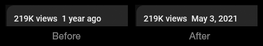
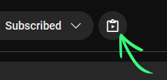

# Youtube to Clipboard

Firefox extension.

Replaces date on video page with proper date.

Also adds button to copy Youtube video information (title, URL, channel, date, length, etc) to Windows clipboard as plain text.

See `signed` dir for .xpi, drag and drop onto Firefox to install.